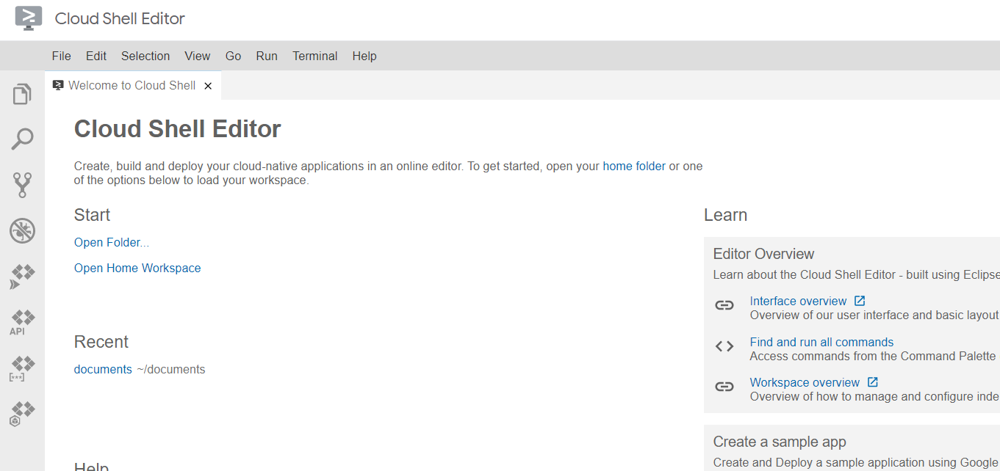
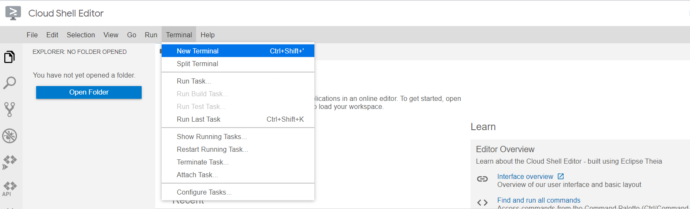
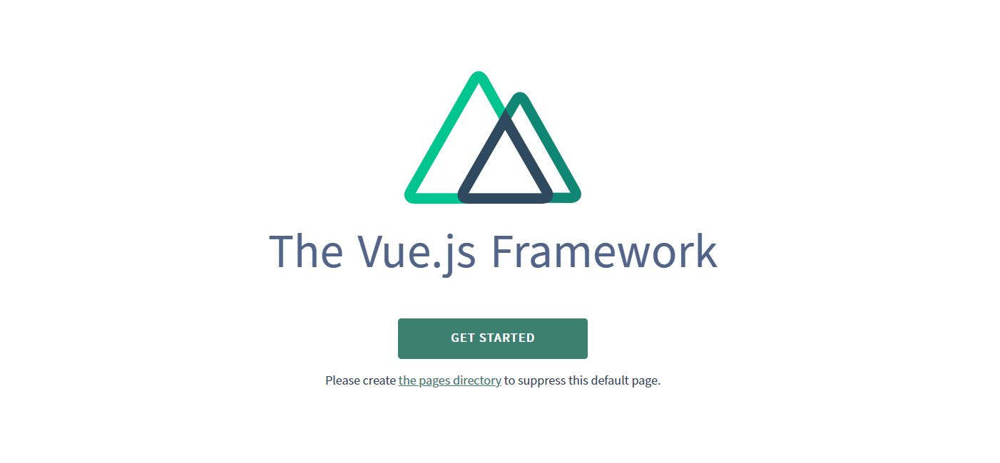
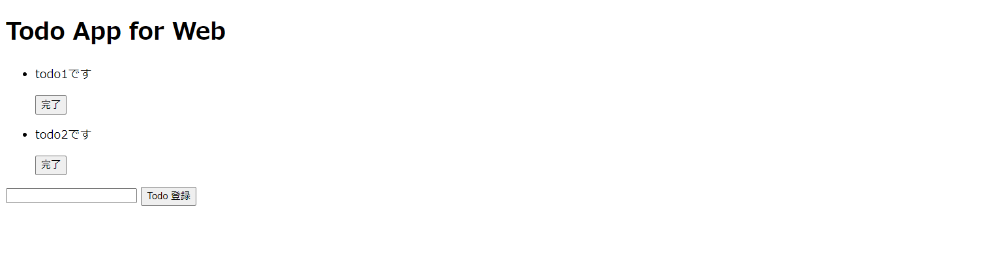
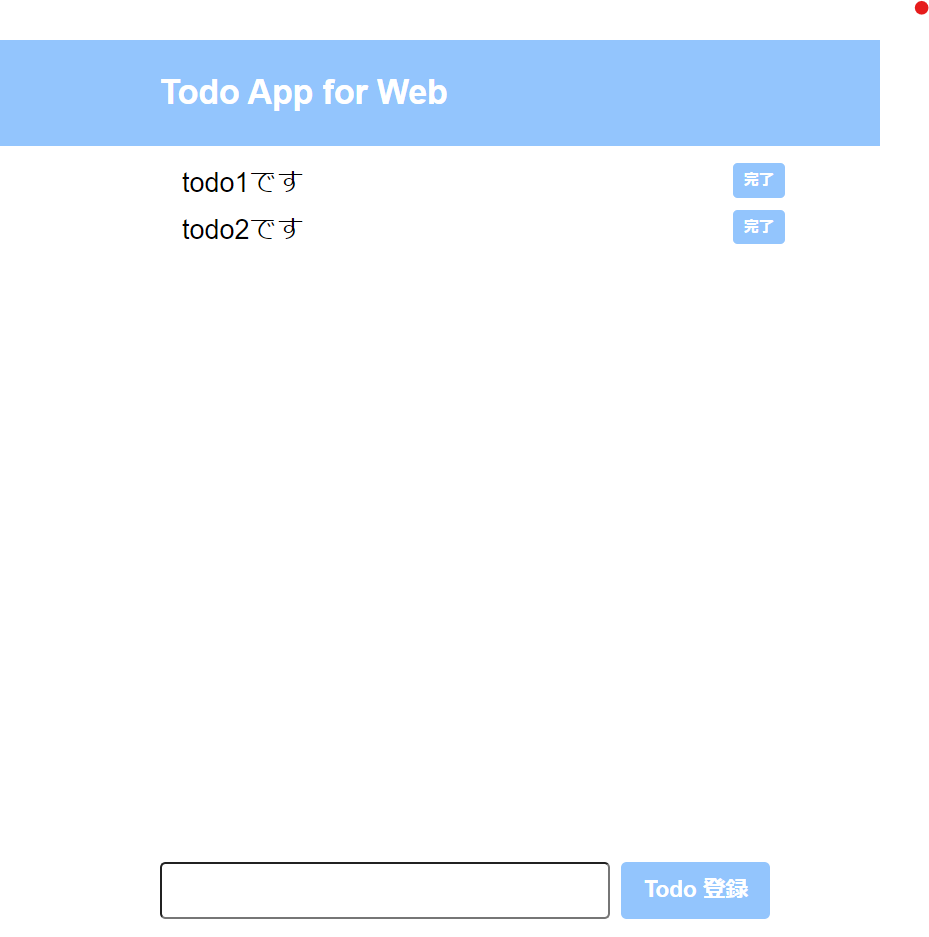

id: nuxt-todo

# Web開発の雰囲気を体験するハンズオン

## 概要
Duration: 0:02:00

このCodelabsでは、簡易的なTodoアプリケーションを作ることを通して、Web開発の雰囲気を体験できます。  
その関係上特定の技術をしっかり学ぶためのものではありません。  
一度簡単なアプリを作ってみて、気になった部分をさらに学び、様々な技術への学びを深めていってください。 
もしご不明点や間違い等あれば、[こちら](https://github.com/dlopp/codelabs/issues)にIssueとして起票いただければと思います。  

実際に作るものはこちらです。  
[https://dlopp-nuxt-todo.netlify.app/](https://dlopp-nuxt-todo.netlify.app/)

### 対象
- プログラミング入門者
- Web開発に興味がある人

### 使用する技術
- [Cloud Shell | Google Cloud](https://cloud.google.com/shell?hl=ja)
- [Nuxt.js - ユニバーサル Vue.js アプリケーション](https://ja.nuxtjs.org/)

次ページから実際にアプリを作っていきます！  

## プロジェクトを作成する

まずは、コマンドを利用してプロジェクトを作成します。  
Cloud Shellを利用することで、必要なプログラミング言語をインストールすることなくアプリを作り始めることができます。下記リンクにアクセスしてください。  
[https://ide.cloud.google.com?hl=ja](https://ide.cloud.google.com?hl=ja)  

こんな感じの画面になっていればOKです。
  


### 新しいフォルダを作る  

ターミナルにコマンドを打っていきます。  
上部メニューバーのTerminalから、New Terminalを選択して下さい。  
  

画面下部にターミナルが出てくるので、下記コマンドを実行してください。  
$は入力不要です。

```bash
  # todo-appという名前のフォルダを作成
  $ mkdir todo-app
```
左側の青いボタン(Open Folder)から、先ほど作成したtodo-appを選択して、開くを押してください。  

### Nuxt.jsの環境を作る
今回は、[npm](https://www.npmjs.com/) というパッケージマネージャを使って、[Nuxt.jsパッケージ](https://www.npmjs.com/package/nuxt)をインストールします。  

下記コマンドを実行してください。
```bash
  # npmを初期化するコマンド
  $ npm init -y
```
package.json, package-lock.jsonが生成されたと思います。  
package.jsonにインストールしたパッケージの情報などが記述されていきます。package-lock.jsonはとりあえずは無視して大丈夫です。  
npmコマンドを使ってNuxt.jsをインストールします。
```bash
  $ npm install nuxt
```
しばらくすると、Nuxt.jsがnode_modulesフォルダ内にインストールされます。  
package.jsonに、このような一文が入力されていればOKです。
```json
  "dependencies": {
    "nuxt": "^2.15.6" // インストールしたnuxtのバージョン
  }
```

フォルダは以下の構造になっているはずです。  
```bash
.
├─ node_modules/ # npmでインストールしたパッケージ類が入ってる
├─ package.json/  
└─ package-lock.json
```


### 試しに実行
まずは何もいじってないこのプロジェクトが正常に動くかどうか確認しておきましょう。下記のコマンドで実行できます。  
```bash
  $ nuxt
```
右上のwebでプレビューから、ポートを変更、3000と入力し、変更してプレビューを押してください。このようなページが表示されていればOKです。  
  

これで最初の準備は整いました。うまく動かない場合は環境設定がうまくいっていない可能性がありますので、エラーメッセージなどを確認してみてください。

次のページから実際にページを作っていきます！

## ページを作成する
Duration: 0:02:00

Positive
: このページの変更は[こちら](https://github.com/dlopp/codelabs/commit/2bb5c7891572c5413638d4e544b4293cd9dab96a)で確認できます。困ったら見てください。  


Nuxt.jsでは、pagesフォルダ内にvueファイルを置くとページとして認識されます。  
pagesフォルダを作って、その中に`index.vue`を置きましょう。 

```bash
.
├─ node_modules/ # npmでインストールしたパッケージ類が入ってる
├─ pages/ 
      └─ index.vue # ここにプログラムを書いていく。 
├─ package.json/  
└─ package-lock.json
```

`.vue`ファイルでは、ページ構造を`<template>`内に、ページのスタイルを`<style>`内に、機能を`<script>`内に書いていきます。  
下記をコピペしてください。

```html
  <template>

  </template>

  <script>
    
  </script>

  <stye>

  </stye>
```
3000番ポートにアクセスして、画面に何も表示されてなければOKです！  

## ページ構造を書く
Positive
: このページの変更は[こちら](https://github.com/dlopp/codelabs/commit/aa9bb23a56ba2ab207370778accff2b72ee51bf1)で確認できます。困ったら見てください。

このチャプターではページ構造を記述していきます。Nuxt.jsでは、`<template>`の中にHTMLっぽく書けます。  

### HTMLとは
マークアップ言語です。マークアップとは、文書の各部分がどのような役割を持っているのかを示すということです。例えば、見出し・段落・表・リストなど。  
HTMLでは、タグというものを使ってこれらを表現します。例えば、見出しなら`<h1>`表なら`<table>`のようなタグを使います。  
HTMLは下記サイトで体系的に学ぶことができます。  
MDN reference: [https://developer.mozilla.org/ja/docs/Web/HTML/](https://developer.mozilla.org/ja/docs/Web/HTML/)

ということで、先ほど書いた`<template></template>`の中にHTMLを書いていきます  
以下のコードを書いてください。(コピペで良いです)
```html
  <template>
    <div class="wrapper">
      <header class="header">
        <div class="container">
          <h1 class="headline">Todo App for Web</h1>
        </div>
      </header>
      <section class="main">
        <ul>
          <li class="card">
            <p class="todo">todo1です</p>
            <button class="done">
              完了
            </button>
          </li>
          <li class="card">
            <p class="todo">todo2です</p>
            <button class="done">
              完了
            </button>
          </li>
        </ul>
        <form class="form">
          <input type="text" class="input" />
          <button type="submit" class="button">Todo 登録</button>
        </form>
      </section>
    </div>
  </template>
```
タグの中にある、`class`というのは、そのタグを特定するために書いているもので、後でスタイルをつけるときに使います。  
ここで使用したタグのそれぞれの意味は下記リンクで見れます。    
MDN reference: [https://developer.mozilla.org/ja/docs/Web/HTML/element](https://developer.mozilla.org/ja/docs/Web/HTML/element) 

3000番ポートで下記のように表示されていればOKです。
  

適切なタグをつけると、ブラウザが良い感じに要素を判断してスタイルをつけてくれます。例えば、todoリストは`ul`タグ(unordered listの略)を使用しているので、箇条書きのようになっていると思います。  
ただ、これだけだと物足りない気がします。次のページで、スタイルをつけていきます！


## スタイルを付ける
Positive
: このページの変更は[こちら](https://github.com/dlopp/codelabs/commit/6264ac4e4951190682e79705d18ba94fd70f84a6)で確認できます。困ったら見てください。

スタイルを付けていきましょう！今回は、CSSというものを使用します。

### CSSとは
ウェブページのスタイルを指定するための言語です。CSSはHTMLと組み合わせて使用する言語です。HTMLが各要素の意味や構造を定義するのに対して、CSSではそれらをどのように装飾するかを指定します。例えば、色・サイズ・レイアウト等です。  
CSSは下記サイトで体系的に学ぶことができます。  
MDN reference: [https://developer.mozilla.org/ja/docs/Web/CSS/](https://developer.mozilla.org/ja/docs/Web/CSS/)  

ということで、先ほど書いた`<stye></stye>`の中にCSSを書いていきます  
以下のコードを書いてください。(コピペで良いです)

```css
  <style>
    :root {
      --main-color: #93c5fd;
      --hover-color: #23c5fd;
    }

    * {
      margin: 0;
      box-sizing: border-box;
      font-family: Arial, Helvetica, sans-serif;
    }

    /* Todo App の Style */
    .wrapper {
      min-height: 100vh;
      position: relative;
    }

    .main {
      margin: 10px auto;
      max-width: 36rem;
    }

    .container {
      max-width: 36rem;
      margin: 0 auto;
    }

    /* headerのstyle */
    .header {
      height: 96px;
      width: 100%;
      background-color: var(--main-color);
    }

    .headline {
      font-size: 30px;
      line-height: 96px;
      margin-left: 20px;
      font-weight: 700;
      color: white;
    }

    /* todoリストのstyle */
    .card {
      display: flex;
      justify-content: space-between;
      align-items: center;
    }

    /* 入力フォームのstyle */
    .form {
      display: flex;
      padding: 0 20px;
      position: absolute;
      bottom: 20px;
    }

    .input {
      border-radius: 5px;
      font-size: 20px;
      padding-left: 10px;
      width: 400px;
      margin-right: 10px;
    }

    .button {
      border-radius: 5px;
      padding: 10px 20px;
      cursor: pointer;
      font-size: 20px;
      font-weight: bold;
      background: var(--main-color);
      color: white;
      border: none;
    }

    .button:hover {
      background-color: var(--hover-color);
    }

    .todo {
      font-size: 1.5rem;
      margin-top: 5px;
    }

    .done {
      padding: 5px 10px;
      font-weight: bold;
      border-radius: 4px;
      color: white;
      background-color: var(--main-color);
      border: none;
      cursor: pointer;
    }

    .done:hover {
      background-color: var(--hover-color);
    }
  </style>
```
先ほどHTMLで書いたclassと連携させて、`padding`や`margin`で余白を指定したり(単位はピクセル)、`color`で文字の色を指定したり、`font-size`で文字の大きさを指定したりしているのが分かると思います。   

3000番ポートで下記のように表示されていればOKです。
  

todoリストらしくなってきたかなと思います！ただ、文字を入力しても、完了ボタンをおしても無反応ですね。  
次ページで、機能を作っていきます！

## Todo機能を作る  

このチャプターでは、Vue.jsのスクリプトを書いて機能を作っていきます。

### Vue.jsとは
JavaScriptのフレームワークの1種です。JavaScriptはブラウザで動作するプログラミング言語です。これらは、フロントエンドの開発によく用いられています。  
JavaScriptは、下記サイトで体系的に学ぶことができます。  
MDN reference: [https://developer.mozilla.org/ja/docs/Web/JavaScript/](https://developer.mozilla.org/ja/docs/Web/JavaScript/)  
Vue.jは下記サイトで学ぶことができます。  
Vue.js公式reference: [https://jp.vuejs.org/v2/guide/index.html](https://jp.vuejs.org/v2/guide/index.html)

ということで、先ほど書いた`<script></script>`の中に書いていきます！

### 仮データをscript側で保持し表示する
Positive
: ここでの変更は[こちら](https://github.com/dlopp/codelabs/commit/037576502b0e7f204c2043072fe37ab63585a939)で確認できます。困ったら見てください。

今のところtodoの内容をtemplateに直書きしているので、動的に動かせるようにscript側で保持します。  
`data()`を使うことで保持できます。下記のように`index.vue`を書き換えてください。  

```html
  <template>
    <!-- 省略 -->
    <section class="main">
      <ul>
        <li v-for="(todo, index) in todoList" :key="index" class="card">
          <p class="todo">{{ todo }}</p>
          <button class="done">
            完了
          </button>
        </li>
      </ul>
    <!-- 省略 -->

  </template>

  <script>
  export default {
    data() {
      return {
        todoList: ['todo1です', 'todo2です'],
      };
    },
  }
  <script>
```
`script`の`data()`内で`todoList`としてデータを保持し、`template`ではその内容を参照するように変えました。  

3000番ポートで下記のように表示されていればOKです。
  

### Todoを追加、削除する機能を追加する

Positive
: ここでの変更は[こちら](https://github.com/dlopp/codelabs/commit/fc07f21b7815a4a83fb9c273df79a6d8ffb1baf2)で確認できます。困ったら見てください。

todoを動的に動かす準備ができたので、これから機能を付けていきます。  
Vue.jsでは、methods内に関数を書くことができます。

下記のように変更して下さい。  
ややこしくなってきたので、`style`以外のすべてを書いておきます。コピペで上書きで構いません。  
```html
<template>
  <div class="wrapper">
    <header class="header">
      <div class="container">
        <h1 class="headline">Todo App for Web</h1>
      </div>
    </header>
    <section class="main">
      <ul>
        <li v-for="(todo, index) in todoList" :key="index" class="card">
          <p class="todo">{{ todo }}</p>
          <button class="done" @click.prevent="completeTodo(index)">
            完了
          </button>
        </li>
      </ul>
      <form @submit.prevent="addTodo" class="form">
        <input type="text" class="input" v-model="title" />
        <button type="submit" class="button">Todo 登録</button>
      </form>
    </section>
  </div>
</template>

<script>
export default {
  data() {
    return {
      title: "",
      todoList: [],
    };
  },
  methods: {
    addTodo() {
      if (this.title.length === 0) {
        alert("todoを入力してください。");
        return;
      }
      this.todoList.push(this.title);
      this.title = "";
    },
    completeTodo(index) {
      this.todoList.splice(index, 1);
    },
  },
};
</script>

<!-- 省略 -->
```
フォームに入力された情報を`data()`内の`todo`として保持し、追加するボタンを押した際、methods内の`addTodo()`が実行され、内容がtodoListの中に追加されます。  
細かいですが、`if`を使って条件分岐し、todoが入力されていないとき、アラートが出るようにしました。
削除するときは、completeTodoを使って、todoList内の該当するindexを持つtodoを削除するようにしています。  

ポート3000番にアクセスしてみて下さい。追加や、削除ができるようになっているかと思います。  
また、todoを入力せずに追加するボタンをおすと、アラートが出ると思います。  

ただ、todoを追加しても、ページをリロードすると消えてしまいます。どこかでデータを保持する必要がありそうです。  
次ページで、todoを保存するようにしましょう！

## Todoを保存する
Positive
: このページの変更は[こちら](https://github.com/dlopp/codelabs/commit/d03222a542adc8912421fbae3b80cae0dac14038)で確認できます。困ったら見てください。


データベースを用意して保存したいところですが、Cloud Shellを使用している都合上厳しいので、今回はLocalStrageを使います。  
一番最後のページで、データベースを利用したバージョンのソースコードを載せておくので、興味のある人は読んでみてください。  

### LocalStrageとは
各自のブラウザにデータを保存する仕組みです。
LocalStrageは、下記サイトで学ぶことができます。  
MDN reference: [https://developer.mozilla.org/ja/docs/Web/API/Window/localStorage](https://developer.mozilla.org/ja/docs/Web/API/Window/localStorage)  


ということで、scriptを以下のように変更してください。(コピペで良いです)

```js
<script>
export default {
  data() {
    return {
      todo: "",
      todoList: [],
    };
  },
  mounted() {
    this.todoList = this.getTodoList()
  },
  methods: {
    getTodoList() {
      let list = localStorage.getItem('todoList')
      if (list === null) {
        return []
      } else {
        return JSON.parse(list)
      }
    },
    addTodo() {
      if (this.todo.length === 0) {
        alert("todoを入力してください。");
        return;
      }
      this.todoList.push(this.todo)
      localStorage.setItem('todoList', JSON.stringify(this.todoList))
      this.todo = "";
    },
    completeTodo(index) {
      this.todoList.splice(index, 1);
      console.log(localStorage.length);
      if (this.todoList.length === 0) {
        localStorage.removeItem('todoList')
        return;
      }
      localStorage.setItem('todoList', JSON.stringify(this.todoList))
    },
  },
};
</script>
```
最初にページを表示するとき`getTodoList()`を呼び出して、LocalStrageからデータを取ってくるようにしています。`addTodo()`、`completeTodo()`もLocalStrageにデータを保存するように書き直しました。  

リロードしても、データが保持されるようになっていたらOKです！  
これで完成です！

## お疲れさまでした！
今回はフロントエンドの技術をつかってTodoアプリを作りました！  
今後プログラミングを勉強していきたいと思う方は、下記サイトが参考になるかなと思います。  
[https://roadmap.sh/](https://roadmap.sh/)  
何を勉強していけばよいかが書かれています  
勉強の助けになれば幸いです！  

## おまけ
今回は、フロントエンドだけでTodoアプリを実装しましたが、本来はサーバーサイドの言語も使用して、データベースを使うのが普通かなと思います。  
ということでそれのデモを用意しました。  
サーバーサイドフレームワークにNestJS、データベースはMySQLを使っています。  
興味のある人は読んでみて下さい！  