author: Yuto Ueki
summary: Flutter の簡単な ToDo アプリ
id: todo_app_for_mobile
categories: codelab,markdown
environments: Web
status: Published

# Flutter を用いた簡単な ToDo アプリを作ろう

## Flutter とは
Duration: 0:02:00


### 概要
- Google が開発しているアプリの作成環境
- 2018 年 12 月 4 日に発表
- 一つのプロジェクトファイルで Android、iOS、Web、Windows、MacOS、Linux アプリを作成可能
- めっちゃ簡単

このツールを利用して簡単なToDoアプリを作ります。以下が完成モデルです。

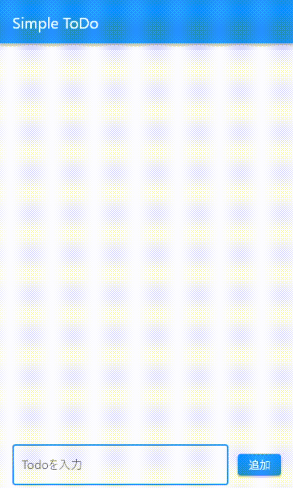

## 利用する環境
Duration: 0:04:00

### ツール

Positive
: Web 上で Flutter を動かせる [DartPad](https://dartpad.dev/?)を利用します。


各自の PC に Flutter の開発環境を構築してもいいですが...
- 大量のファイルをダウンロードする必要がある
- 環境変数の設定など、様々な設定をする必要がある
- 筆者のそこそこスペックの PC と光回線を使っても 30 分くらいかかる

ということで、Web 上で動く[DartPad](https://dartpad.dev/?)を利用したほうが楽ちんなのです。


### 最初に

1. **Null Safety を解除する**
  - 下のバーにボタンがあるので解除してください
  - Null の扱いを記述するのがややこしいのと、今は必要ない知識だからです
1. **基礎になるコードをコピー**
  - 以下のコードをコピーしてください。

Positive
: 下記のコードは、Flutterプロジェクトファイルを作成したときに勝手に作られるサンプルコードに基づいています。お決まりの文言といった感じです。

```dart
import 'package:flutter/material.dart';

void main() {
  runApp(MyApp());
}

class MyApp extends StatelessWidget {
  @override
  Widget build(BuildContext context) {
    return MaterialApp(
      debugShowCheckedModeBanner: false,
      theme: ThemeData(primarySwatch: Colors.blue),
      home: MyHomePage(),
    );
  }
}

class MyHomePage extends StatefulWidget {
  @override
  _MyHomePageState createState() => _MyHomePageState();
}

class _MyHomePageState extends State<MyHomePage> {
  @override
  Widget build(BuildContext context) {
    return Scaffold();
  }
}
```


## UIを作るには
Duration: 0:04:00

### UI作りの考え方
Flutter の場合、Widgetと呼ばれるUIパーツを組み合わせて画面を作っていきます。

Positive
: [Flutter:Widget一覧](https://qiita.com/matsukatsu/items/e289e30231fffb1e4502)を見てみると、たくさんあるのがわかります。

### デザインの種類

デザインにはたくさんの種類があります。モバイルアプリでは以下の２つが有名です。結局AndroidっぽいかiOSっぽいかになります。

- マテリアル・デザイン
  - Googleが推しているデザイン。Flutterはこれです。  
  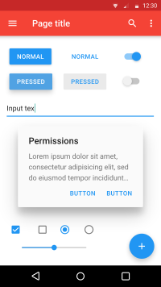
- クパチーノ・デザイン
  - Appleが推しているデザイン。Apple本社がクパチーノにあります。  
  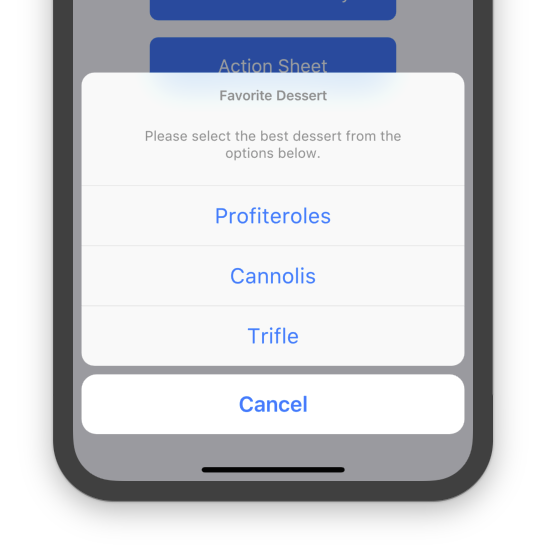

### Runしてみる

基礎になるコードを貼り付けたらRunボタンを押してみてください。  
真っ白の画面が表示されるはずです。ここから画面を作っていきます。
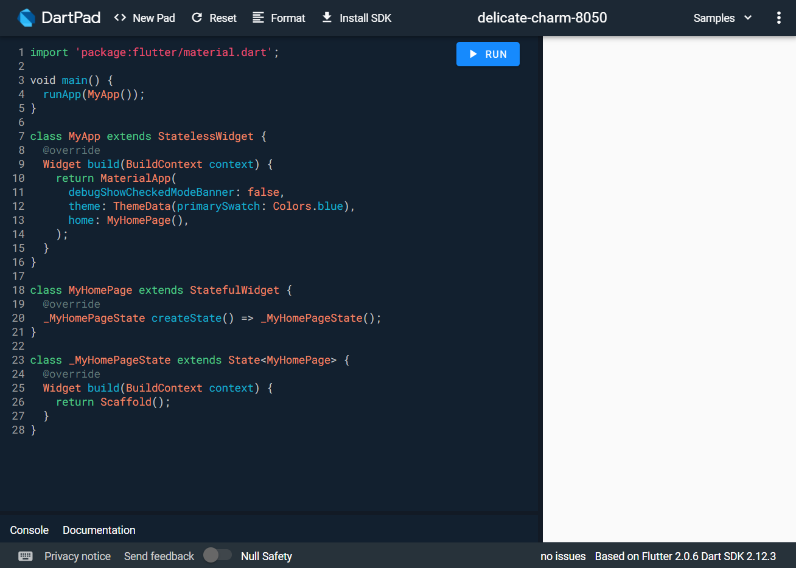


## Scaffold()

この白い画面は`Scaffold()`Widgetが作り出しています。  
`Scaffold()`Widgetはすべての土台となるWidgetです。

`Scaffold()`Widgetはたくさんのプロパティを持っていますが、今回使うのは`appBar`と`body`です。`appBar`になにかWidgetを持たせるとそこに表示されますし、`body`も同じです。２つの領域が作られるような感じです。


## AppBar()・Text()

`appBar`に`AppBar()`Widgetを持たせましょう。これで画面上部にバーが表示されます。

```dart
return Scaffold(
      appBar: AppBar(
        title: Text('Simple ToDo'),
      ),
    );
```

`AppBar()`Widgetには`title`プロパティがあり、そこに`Text()`Widgetを置いています。`AppBar()`Widgetには`title`という領域があるということです。  
`Text()`Widgetの`()`の中に`''`付きで文字を置くと、その文字が画面上に表示されます。


## Column()

次に下のテキストボックスを作りたいのですが、下の画像のように、ToDo要素とテキストボックスが縦に並んでいます。Flutterの場合、要素を縦に並べるWidgetとして、`Column()`Widgetがあります。

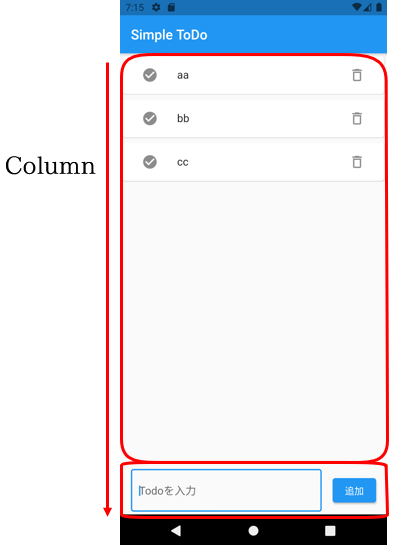

`Column()`Widgetを設置します。`Scaffold()`Widgetの`body`領域に置きます。

```dart
return Scaffold(
      appBar: AppBar(
        title: Text('Simple ToDo'),
      ),
      body: Column(
        mainAxisAlignment: MainAxisAlignment.start,
        children: [
          
        ],
      ),
    );
```

`mainAxisAlignment: MainAxisAlignment.start,`とは、要素をどういう感じに並べるかの設定です。この場合、上から単純に並べるものです。他には、要素を等間隔に並べたり、中央に集中させたりできます。  
`children: [],`の中に並べたい要素を列挙していきます。

## ListTile()・Form()・TextFormField()

下記のコードを書きましょう。

```dart
children: [
          ListTile(
            title: Form(
              child: TextFormField(
              ),
            ),
          ),
        ],
```

### ListTile()

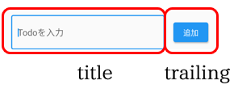

`ListTile()`Widgetも画面を分割するWidgetです。

Positive
: ちなみに、`title`の左に`leading`という領域もあります。あとで使います。

### Form()・TextFormField()

`Form()`Widgetは`TextFormField()`Widgetを使うための前提Widgetです。`TextFormField()`Widgetが実際に画面に表示されるテキストボックスです。

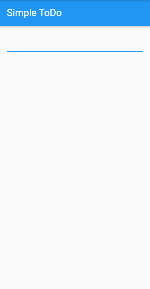

## InputDecoration()・OutlineInputBorder()・ElevatedButton()

### InputDecoration()・OutlineInputBorder()

テクストボックスは見た目や情報を変えることができます。  
下記のようなWidgetを置いてみましょう。

```dart
children: [
          ListTile(
            title: Form(
              child: TextFormField(
                decoration: InputDecoration(
                    border: OutlineInputBorder(), hintText: 'Todoを入力'),
              ),
            ),
          ),
        ],
```

`TextFormField()`の`decoration`プロパティに`InputDecoration()`Widgetを置くと装飾ができるようになります。  
`border`プロパティに`OutlineInputBorder()`Widgetを置くと、テクストボックスが縁取られたデザインになります。  
`hintText`プロパティはテキストボックス内に何を書くべきかのヒント文章を表示できます。


### ElevatedButton()

テキストボックスの右にボタンを置きましょう。  
`ListTile()`Widgetの`trailing`プロパティにボタンのWidgetを置けば、テクストボックスの右にボタンを置けそうです。

```dart
trailing: ElevatedButton(
      onPressed: () {
      },
      child: Text('追加')
),
```

ボタンにはいくつか種類がありますが、`ElevatedButton()`が見やすいと思います。  
`child`プロパティに`Text()`Widgetでボタン内に文字を表示できます。  
`onPressed`プロパティはボタンが押されたときにどんな処理をするのかを記述します。

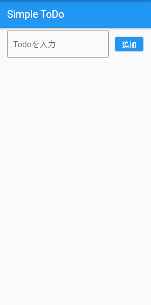

## ボタンが押されたときの処理

さあ、ここまで画面にUI要素をただ置いていく作業でした。ここからプログラミングらしいことをしてみましょう。  

### 実装する機能

以下の機能を実装します
- テキストボックス内に書かれた文字を配列に格納

### 考え方

実装する機能を具体的に言葉で説明すると、  
**「ボタンが押されたときに、テキストボックス内に書かれた文字を認識して、どこかに保存する」**です。つまり、
- 現状だとボタンとテキストボックスは赤の他人状態です。何も関係性はありません。ボタンを押すとテキストボックス内を参照させる必要があります。
- 「どこか」に当てはまる場所は、実際のアプリであればサーバーにあたります。様々なデータを保存しておく場所です。ただし、ちょっと大変なので今回は**配列**に保存してみましょう。

### 配列とは

- 配列の前に、変数という概念を知りましょう。変数とは、ずばり**「箱」**です。文字列、数字、命令など、なんでも入ります。使い方は、  
1. 箱を用意（名前をつける）して、なにか入れる
1. 箱の名前をコード上に書く
これだけです。使いたいときにはこの名前をコード上に書くと、コンピューターが箱の中身を展開して使ってくれます。

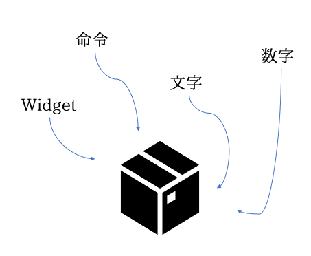

- 次に配列とは、**「箱の中に仕切りがついている箱」**です。イメージはマンションに近いと思います。

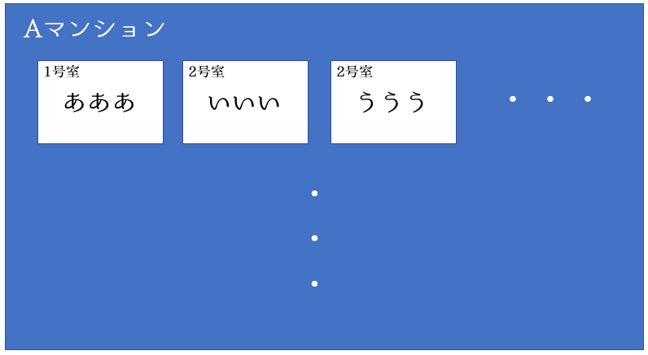

Aマンションの１号室には「あああ」という文字列が入っています。コード上で「Aマンションの１号室！」と呼ぶと、展開されて「あああ」が取り出されます。この「Aマンション」にあたるのが**配列名**です。


## 実装

### 配列とTextEditingController()

```dart
class _MyHomePageState extends State<MyHomePage> {
  var todos = [];
  var textbox = TextEditingController();

  @override
```

一気に書きましたが、`todos`と`textbox`という変数を用意しました。`[]`が配列を表します。つまり、`todos`という変数の中身は配列だよということです。同じように`textbox`という変数には`TextEditingController()`というWidgetを入れました。`TextEditingController()`はテキストボックス内に何か書くと、文字だけでなく様々な情報が入るWidgetです。

### ボタンとテキストボックスを連携

```dart
child: TextFormField(
  decoration: InputDecoration(
    border: OutlineInputBorder(),
    hintText: 'Todoを入力'),
  controller: textbox,
),
```

`TextFormField()`の`controller`に用意した`textbox`を持たせます。これでテキストボックスに書かれた文字などの情報が`textbox`に入っている`TextEditingController()`に入ります。

```dart
trailing: ElevatedButton(
  onPressed: () {
    setState(() {
      todos.add(textbox.text);
      textbox.clear();
    });
  },
  child: Text('追加')
),
```

配列に要素を追加するには、`配列名.add(追加したいもの)`という書き方をします。今回は`todos`に`add`します。追加したいものは`textbox.text`になります。`.text`によって、`TextEditingController()`に入っている情報のテキスト要素を取り出しています。  
`textbox.clear()`は`add`したあとにテキストボックス内をリセットするということです。`add`したのにテキストボックス内に文字が残っていたら嫌です。

```dart
todos.add(textbox.text);
textbox.clear();
print(todos);
```

`print(todos)`によって、`todos`の中身を覗くことができます。consoleという手元で確認する用のパネルに表示します。  

テキストボックス内にテキストを入力して、追加ボタンを押したときにconsoleに文字が表示されたらOK！

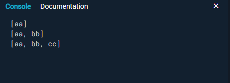

## 配列の中身を画面に表示

いよいよ追加したToDoを画面に表示して見えるようにします。どうするかというと、配列の中身を画面に表示するWidgetを用います。

### Expanded()・ListView.builder()

ToDoをテキストボックスの上に表示させます。そのためには、`Column()`の中の`children[]`の中に、テキストボックスの上にWidgetを配置します。

Positive
: `Column()`の`children[]`は`[]`なので、配列になっています！配列の中身を縦列に順番に表示するWidgetですね。

```dart
body: Column(
  mainAxisAlignment: MainAxisAlignment.start,
  children: [
    Expanded(
      child: ListView.builder(
        itemCount: ,
        itemBuilder: (context, index) {
          return;
        }
      )
    ),
```

`Expanded()`Widgetは便利なWidgetで、子要素を縦幅いっぱいまで自動的に広げるWidgetです。普通縦幅を自分で設定しなければダメなのですが、これは自動的に広げてくれます。  

`ListView.builder()`は指定した配列やデータベースから、要素を一個づつ表示させるWidgetです。`itemCount`は要素を全部で何個表示するかです。今回は`todos`配列の中身の数だけ表示させるので、こうします。

```dart
itemCount: todos.length,
```

Positive
: `配列名.length`で、配列の中身の要素数を扱うことができます。

配列の中身の要素は`itemBuilder`の`return`の次に書かれた形で表示します。一つ一つの要素の見た目を`return`の次で決めるということです。

## Card()

先程の`return`の続きを作っていきましょう。非常に便利な`Card()`Widgetを使います。いい感じに影がついていて見やすいです。

```dart
itemBuilder: (context, index) {
  return Card(
    child: Text(todos[index])
  );
}
```

`Card()`の中身は`Text()`で`todos[index]`としました。配列の解説のところで、「配列名の何番目！」と呼ぶと、その値が取り出されると言いました。なので、`todos[0]`とすると`todos`の1番目が取り出され、`todos[1]`とすると`todos`の2番目が取り出されます。  

今回は、`index`番目としました。`index`とは、`itemBuilder`で使われている`index`という単語です。`itemBuilder`は配列の中身を1個づつすべてチェックしていくメソッドです。1個めをチェックしているときは`index`は`0`です。2個めをチェックしているときは`index`は`1`です。このように、`index`は順番に数字が＋１されていきます。これを利用しています。

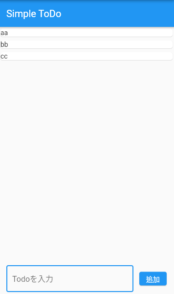

## 再びListTile()。そしてIconButton()

このままだと見づらい上に、いろいろボタンを置きたいので、`ListTile()`をまた使いましょう。（ほんと便利です）

```dart
return Card(
  child: ListTile(
    title: Text(todos[index])
  )
);
```

とりあえず、`title`に`Text()`を置きました。いい感じに余白が空いて見やすくなったと思います。  

### IconButton()

ToDoが完了したときの完了ボタン、ToDoを削除するときの削除ボタンをアイコンでやりたいと思います。そこで使うのが`IconButton()`Widgetです。

```dart
child: ListTile(
  leading: IconButton(
    icon: Icon(Icons.check_circle),
    onPressed: () {
      
    }
  ),
  title: Text(todos[index]),
  trailing: IconButton(
    icon: Icon(Icons.delete_outline),
    onPressed: () {
      
    }
  ),
)
```

Negative
: プロパティ終わりの`,`に注意！！

`ListTile()`の`leading`（左）と`trailing`（右）にアイコンを置きました。`IconButton()`の`icon`で何のアイコンを置くのか、`onPressed`で押されたときの処理を決めます。  

Fluterがあらかじめ用意してくれているアイコンを用いました。よくみるようなアイコンかと思います。ちなみに、Flutterのアイコンは十分以上にたくさんあります。ありすぎて、見ているだけで楽しいです。[Flutterのアイコンはこちら](https://api.flutter.dev/flutter/material/Icons-class.html)

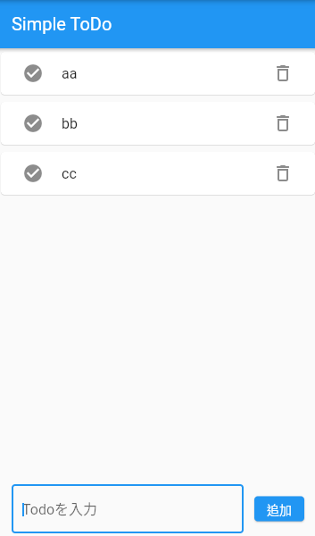

## Iconを押したときの処理

`IconButton()`の`onPressed`の処理を何も書いていないので、押しても何も起こりません。タスク完了のチェックマークとゴミ箱ボタンを押したときの処理を書いてみましょう。  
タスクが完了した時、または削除する時は配列内からその要素を消してあげれば画面に表示されなくなります。

### removeAt()

```dart
onPressed: () {
  setState(() {
    todos.removeAt(index);
  });
}
```

Positive
: チェックマークとゴミ箱の両方の`IconButton()`に書いてください！

`removeAt()`はWidgetではなく、メソッドです。配列内の特定番目の要素を削除するメソッドです。`removeAt( 0 )`とすると、配列内の１番目が削除されます。今回は`index`番目です。

## ダイアログ表示

これでも一応動作しますが、タスク完了とタスク削除の区別がつきにくいです。なので、削除するときは「削除しますか？」というダイアログを表示させてみます。

### AlertDialog()

ダイアログにも種類がありますが、`AlertDialog()`を使います。Flutterでダイアログを表示させるには一旦`showDialog()`というメソッドをかます必要があります。

```dart
onPressed: () {
  showDialog(
    context: context,
    builder: (_) {
      return AlertDialog(

      );
    }
  );
}
```

`AlertDialog()`の中身を書いていきます。

```dart
return AlertDialog(
  title: Text('削除しますか？'),
  actions: [
    TextButton(
      child: Text('削除'),
      onPressed: () {
        setState(() {
          todos.removeAt(index);
        });
        Navigator.pop(context);
      },
    ),
    TextButton(
      child: Text('キャンセル'),
      onPressed: () {
        Navigator.pop(context);
      },
    ),
  ],
);
```

`title`はダイアログのメインテキストです。`actions`は下部に表示されるボタン類を置く場所です。削除ボタンとキャンセルボタンを用意しました。つかうWidgetは`TextButton()`です。削除する場合は`onPressed`内に`removeAt(index)`で削除するメソッドを置いています。  
`Navigator.pop(context)`というのは、画面を一つ前の状態に戻す効果があります。このハンズオンでは実装しませんが、画面遷移をしたときに前の画面に戻すときもこれを使います。これを書かない場合、ボタンを押してもずっとダイアログが表示されたままになります。

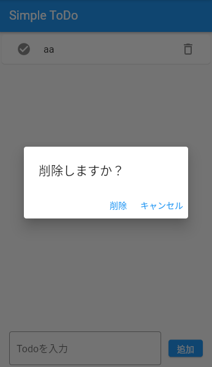